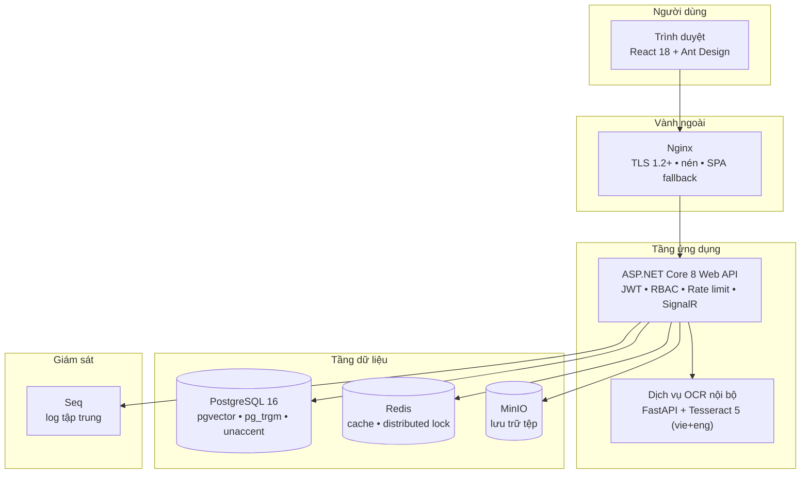
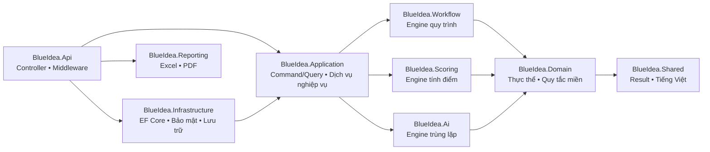
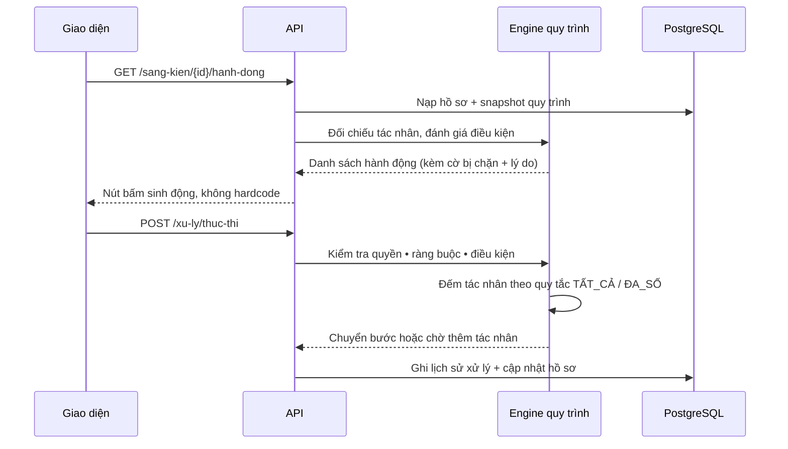
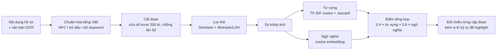
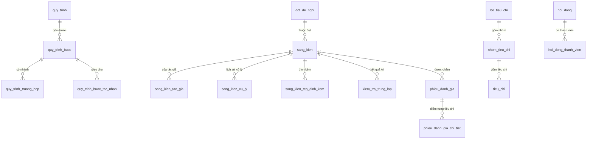

# Tài liệu mô tả giải pháp

---

## 1. Tổng quan

BlueIdea số hóa toàn trình hoạt động sáng kiến của chính quyền địa phương: từ lúc tác giả đăng ký
hồ sơ, qua tiếp nhận, thẩm định, hội đồng chấm điểm, đến công nhận và thống kê báo cáo.

Đặc điểm cốt lõi: **nghiệp vụ là dữ liệu, không phải mã nguồn**. Quy trình xử lý, tiêu chí chấm
điểm, thành phần hồ sơ, vai trò, menu và biểu mẫu đều cấu hình được trên giao diện quản trị.
Khi đơn vị đổi quy trình xét duyệt, quản trị viên tự điều chỉnh mà không cần lập trình viên.

---

## 2. Kiến trúc tổng thể

Toàn bộ dịch vụ dữ liệu chỉ mở trên `127.0.0.1`, không expose ra Internet.

---

## 3. Kiến trúc mã nguồn

Clean Architecture với một điều chỉnh quan trọng: **các nghiệp vụ phức tạp nhất được tách thành
engine thuần logic, không phụ thuộc cơ sở dữ liệu**. Nhờ vậy chúng được kiểm thử trọn vẹn bằng
unit test chạy trong vài trăm mili-giây, thay vì phải dựng cả hệ thống.

Chiều phụ thuộc luôn hướng vào trong. Tầng Application chỉ biết tới các **hợp đồng**
(`IAppDbContext`, `ILuuTruTep`, `IDichVuMaHoa`…); tầng Infrastructure cài đặt chúng.

### CQRS nhẹ

- **Command làm thay đổi trạng thái** đi qua MediatR với pipeline 4 lớp:
  ghi log hiệu năng → kiểm tra dữ liệu (FluentValidation) → **kiểm tra quyền** → ghi audit log.
  Nhờ pipeline này, không command nào có thể "quên" kiểm tra quyền hay ghi nhật ký.
- **Truy vấn đọc và CRUD danh mục** dùng dịch vụ trực tiếp, tránh thêm lớp trừu tượng không cần thiết.

---

## 4. Ba engine nghiệp vụ

### 4.1 Engine quy trình động

Bốn điểm thiết kế đáng chú ý:

**Snapshot quy trình.** Hồ sơ chạy theo bản sao cấu hình lúc nộp, không theo quy trình hiện hành
— xem [ADR 0002](ADR/0002-quy-trinh-snapshot.md).

**Rule evaluator tự viết.** Điều kiện chuyển tiếp lưu dạng `jsonb`, hỗ trợ
`= != > >= < <= IN CONTAINS BETWEEN` và `AND/OR/NOT` lồng nhau. Không dùng `eval` động,
có giới hạn độ sâu 20 cấp để chống dữ liệu độc hại. Toán tử `CONTAINS` trên văn bản so khớp
**không phân biệt dấu tiếng Việt**.

**Không hardcode nút bấm.** Giao diện hỏi API xem người dùng hiện tại được làm gì. Nút không đủ
điều kiện vẫn hiển thị nhưng bị mờ, kèm lý do cụ thể — người dùng hiểu vì sao chưa bấm được.

**Hạn xử lý theo ngày làm việc.** Loại trừ thứ Bảy, Chủ nhật và ngày nghỉ lễ (hỗ trợ ngày lễ
lặp lại hằng năm và ngày nghỉ riêng của đơn vị). Có chặn vòng lặp vô hạn khi cấu hình sai.

### 4.2 Engine tính điểm

Ba cách tính: tổng điểm, trung bình cộng, trung bình theo trọng số nhóm.
Hỗ trợ loại 1 điểm cao nhất + 1 thấp nhất khi có từ 5 phiếu. Làm tròn theo cấu hình, dùng
`MidpointRounding.AwayFromZero` để khớp thông lệ hành chính Việt Nam.

Phiếu chấm lưu **snapshot bộ tiêu chí**, nên sửa tiêu chí về sau không làm sai lệch phiếu cũ.

Nguyên tắc **chấm điểm độc lập** được bảo đảm ở tầng dữ liệu: điểm của thành viên khác chỉ hiện
sau khi phiếu đã được gửi.

### 4.3 Engine kiểm tra trùng lặp

Chạy hoàn toàn nội bộ, không gọi API bên thứ ba — xem [ADR 0001](ADR/0001-ai-noi-bo.md).

Đo thực tế trên dữ liệu mẫu: đối chiếu 1 hồ sơ với 35 hồ sơ khác mất **~400 ms**; cặp hồ sơ cố ý
trùng được phát hiện ở mức **85,7 %** trong khi hồ sơ không liên quan chỉ **31 %**.

**Xử lý stopword tiếng Việt — một chi tiết dễ sai.** Việc so khớp chạy trên văn bản đã bỏ dấu,
mà nhiều hư từ sau khi bỏ dấu lại trùng với thuật ngữ nghiệp vụ quan trọng: `hồ sơ` → `ho so`,
`đơn vị` → `don vi`, `trọng số` → `trong so`, `văn bản` → `van ban`, `kết quả` → `ket qua`.
Nếu đưa `ho`, `so`, `vi`, `trong`, `van`, `qua` vào danh sách stopword thì các thuật ngữ này bị
phá hủy và kết quả so khớp sai lệch. Vì vậy danh sách stopword được chọn rất thận trọng, chỉ giữ
những hư từ **không trùng** thuật ngữ nghiệp vụ sau khi bỏ dấu. Quy tắc này có unit test bảo vệ.

---

## 5. Mô hình dữ liệu

Khoảng 55 bảng, chia 7 nhóm: danh mục, quy trình, tiêu chí, hội đồng, hồ sơ sáng kiến, AI,
quản trị hệ thống.

Quy ước áp dụng cho **mọi bảng**:

| Quy ước | Cài đặt |
|---|---|
| Khóa chính | `uuid` sinh từ ứng dụng, cột có `DEFAULT gen_random_uuid()` cho truy vấn trực tiếp |
| Audit | `nguoi_tao_id`, `ngay_tao`, `nguoi_sua_id`, `ngay_sua` — điền tự động bằng interceptor |
| Soft delete | `da_xoa` + global query filter; lệnh xóa cứng tự chuyển thành xóa mềm |
| Thời gian | `timestamptz` lưu UTC, hiển thị theo `Asia/Ho_Chi_Minh` |
| Tìm kiếm tiếng Việt | Cột `*_khong_dau` đồng bộ tự động khi lưu |
| Dữ liệu bán cấu trúc | `jsonb` cho điều kiện, cấu hình, snapshot |

Sắp xếp dùng collation ICU `vi-VN` để đúng thứ tự bảng chữ cái tiếng Việt.

### Quan hệ trung tâm

---

## 6. Bảo đảm chất lượng

| Loại | Số lượng | Phạm vi |
|---|---|---|
| Unit test | 166 | Rule evaluator, validator 7 quy tắc, engine tính điểm, tính hạn ngày làm việc, SimHash/MinHash/TF-IDF, chuẩn hóa tiếng Việt, engine quy trình |
| Integration test | 6 | Chạy trên PostgreSQL thật (Testcontainers): luồng end-to-end đầy đủ, phân quyền, tìm kiếm không dấu, phát hiện trùng lặp |
| Kịch bản end-to-end | 29 bước | Qua API thật, 8 tài khoản với 6 vai trò khác nhau |

Toàn bộ mã nguồn bật `TreatWarningsAsErrors` và kiểm tra lỗ hổng gói NuGet ở mức lỗi build.

Luồng nghiệp vụ được kiểm chứng đầy đủ: nộp hồ sơ → tiếp nhận → thẩm định → phân công →
3 thành viên chấm → tổng hợp điểm → hội đồng kết luận Đạt → ban hành quyết định → báo cáo.

---

## 7. Đáp ứng yêu cầu phi chức năng

| Tiêu chí | Mục tiêu | Cách đáp ứng |
|---|---|---|
| Thời gian phản hồi API | P95 < 500 ms | Chỉ mục đầy đủ; truy vấn `AsNoTracking`; cảnh báo tự động khi vượt ngưỡng |
| Đồng thời ≥ 500 người | Không suy giảm rõ rệt | Kết nối gộp; cache cấu hình và phân quyền; API không giữ trạng thái |
| Tải trang đầu < 3 s | Đạt | Chia gói theo route, tải chậm từng trang, nén Brotli/Gzip |
| Tiếng Việt | Unicode NFC, sắp xếp `vi-VN` | Chuẩn hóa NFC ở interceptor; collation ICU `vi-VN` |
| Chịu lỗi | Suy giảm mềm | OCR hoặc kiểm tra trùng lặp lỗi thì hồ sơ vẫn nộp được, chỉ đánh dấu chưa kiểm tra |
| Giám sát | Health check, log tập trung | `/health`, `/health/ready`, Seq |
| Trình duyệt | Chrome, Edge, Firefox, Safari | React 18 + Ant Design 5, build theo ES2022 |
| Responsive | Từ 320 px | Bố cục lưới, menu Drawer trên di động, bảng cuộn ngang trong khung riêng |
| Truy cập trên thiết bị di động (chức năng 42) | Dùng được trên điện thoại | Đáp ứng bằng **web responsive**: mở trình duyệt là dùng, không phải cài ứng dụng và không phụ thuộc chu kỳ duyệt của kho ứng dụng. Đổi lại là không có thông báo đẩy và không dùng được ngoại tuyến |
